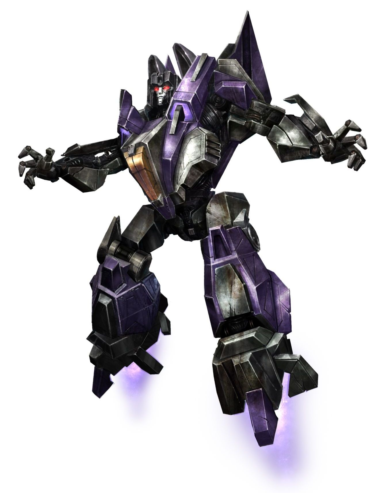

An [ES6](http://www.ecma-international.org/ecma-262/6.0/) MVVM App-Template for [WinJSRocks](https://github.com/deepelement/winjsrocks)
=====

 - [Installing](#installing)
 
#Installing

- clone down the project
- run `npm install` 
- run `npm start` to launch [BrowserSync](http://www.browsersync.io/) enabled site at `http://localhost:3000`
